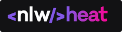
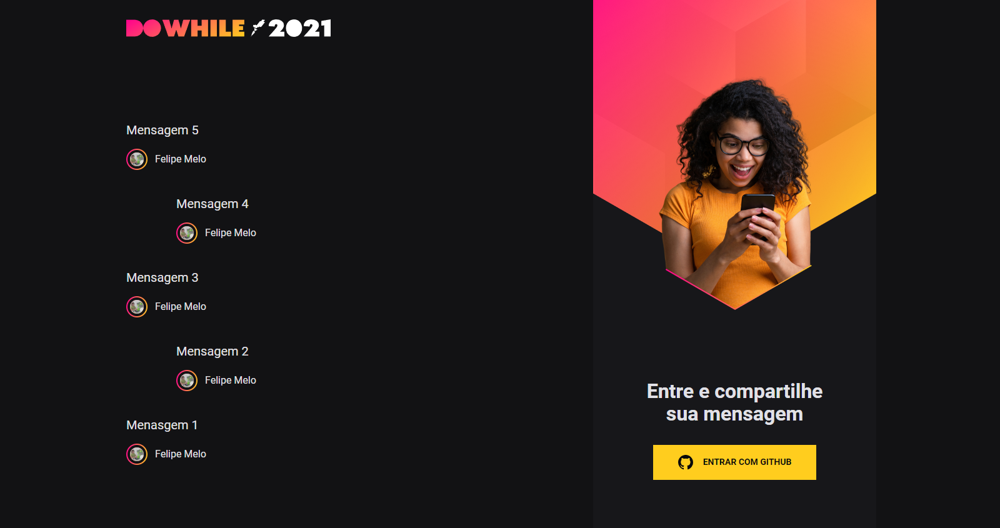
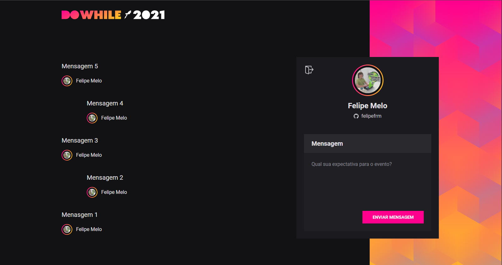

<h1 align="center">
    
</h1>

<p align="center">
  

  
	
  <a href="https://www.linkedin.com/in/felipe-melo-a78504186/">
    
  </a>

  <a href="https://github.com/felipefrm/nlw-heat/commits/master">
    
  </a>
</p>

<p align="center">
  <a href="#projeto">Projeto</a>&nbsp;&nbsp;&nbsp;|&nbsp;&nbsp;&nbsp;
  <a href="#tecnologias">Tecnologias</a>&nbsp;&nbsp;&nbsp;|&nbsp;&nbsp;&nbsp;
  <a href="#screenshots">Screenshots</a>&nbsp;&nbsp;&nbsp;|&nbsp;&nbsp;&nbsp;
  <a href="#layout">Layout</a>&nbsp;&nbsp;&nbsp;|&nbsp;&nbsp;&nbsp;
  <a href="#como-usar">Como usar</a>&nbsp;&nbsp;&nbsp;|&nbsp;&nbsp;&nbsp;
</p>

<a id="projeto"></a>
## 💻 Projeto 

Aplicação fullstack feita no NLW para o evento DoWhile 2021 que ocorreu em dezembro. A aplicação permite que o usuário escreva mensagens e interaja com outros usuários em tempo real.

<p align="center">
   
</p>

<a id="tecnologias"></a>
## :rocket: Tecnologias

Este projeto foi desenvolvido utilizando as seguintes tecnologias:

- [Node.js][nodejs]
- [Express](https://expressjs.com/pt-br/)
- [TypeScript][typescript]
- [ReactJS][reactjs]
- [Prisma](https://www.prisma.io/)
- [SQLite](https://www.sqlite.org/index.html)
- [Socket.io](https://socket.io/)
- [SASS](https://sass-lang.com/)
- [Axios](https://axios-http.com/docs/intro)
- [JsonWebToken](https://jwt.io/)
- [Github OAuth](https://docs.github.com/pt/developers/apps/building-oauth-apps/authorizing-oauth-apps)

<a id="screenshots"></a>
## 🖥️ Screenshots

### - Tela sem autenticação do usuário
<div>
   
</div>

### - Tela com autenticação do usuário
<div>
   
</div>

<a id="layout"></a>
## 🔖 Layout

- O Layout do projeto está disponível no [Figma](https://www.figma.com/) através [desse link](https://www.figma.com/community/file/1031699316177416916).


<a id="como-usar"></a>
## :information_source: Como usar

- ### **Pré-requisitos**

  - É **necessário** possuir o **[Node.js](https://nodejs.org/en/)** instalado na máquina
  - Também, é **preciso** ter um gerenciador de pacotes seja o **[NPM](https://www.npmjs.com/)** ou **[Yarn](https://yarnpkg.com/)**.

1. Faça um clone :

```sh
  $ git clone https://github.com/felipefrm/nlw-heat.git
```

2. Executando o Back-End:

```sh

  # Navegue à pasta do backend
  $ cd /backend

  # Instale as dependências
  $ npm install

  # Crie o banco de dados
  $ npx prisma migrate dev

  # Inicie o backend
  $ npm run dev
```

3. Executando o Front-End:

```sh
  # Navegue à pasta do frontend
  $ cd /frontend
  
  # Instale as dependências
  $ npm install
  
  # Inicie o frontend
  $ vite

  # A aplicação estará rodando no endereço: localhost:3000
```


<h4 align="center">
     Feito por <a href="https://www.linkedin.com/in/felipe-melo-a78504186/" target="_blank">Felipe Melo</a>
</h4>

[nodejs]: https://nodejs.org/
[typescript]: https://www.typescriptlang.org/
[expo]: https://expo.io/
[reactjs]: https://reactjs.org
[rn]: https://facebook.github.io/react-native/
